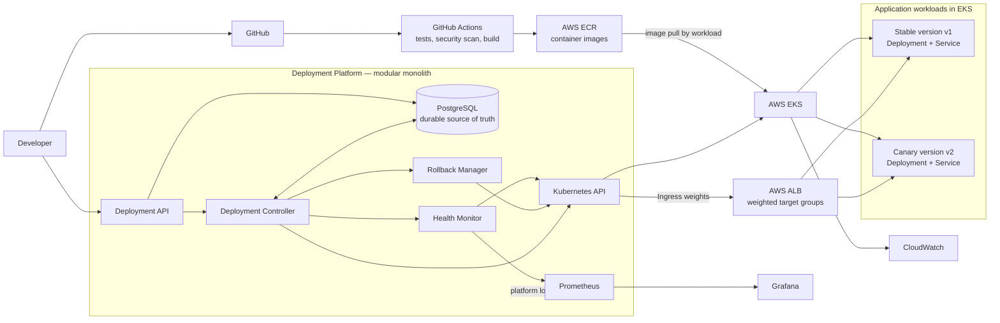
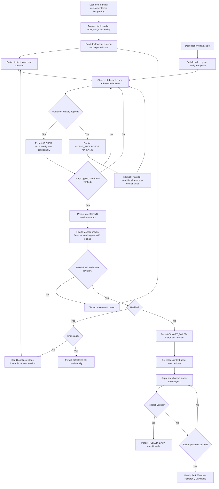
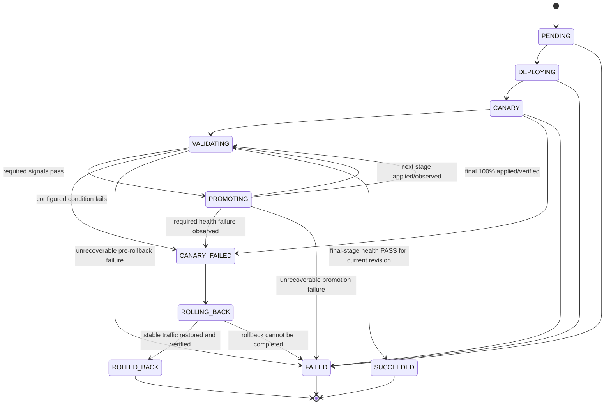
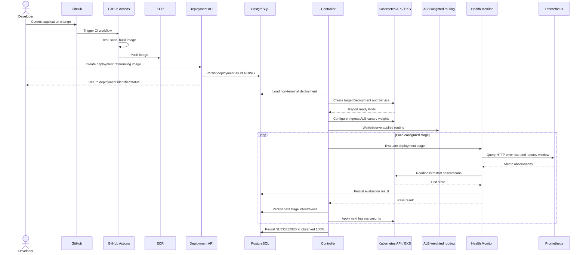
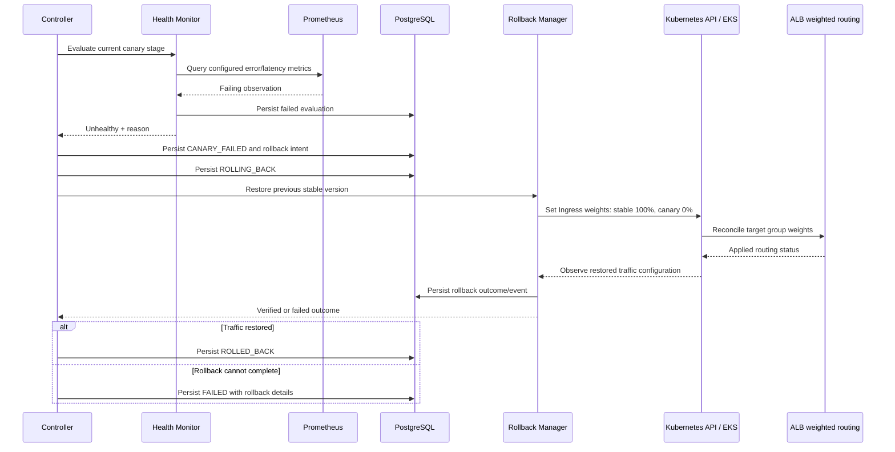

# System Architecture — Cloud-Native Deployment & Reliability Control Plane

## 1. Purpose and Architecture Summary

This document defines the component structure and interactions for the Cloud-Native Deployment & Reliability Control Plane. `PROBLEM_DEFINITION.md` and `REQUIREMENTS.md` are the sources of truth. This is an architecture description only; it does not define schemas, manifests, infrastructure configuration, or implementation code.

The MVP is a **modular monolith**: one platform application contains the Deployment API and background controller, with Health Monitor and Rollback Manager as internal modules. PostgreSQL stores durable state and serializes controller ownership. One active controller worker performs control-plane mutations at a time. Redis is not part of the MVP path. The controller continuously reconciles persisted desired deployment state against observed Kubernetes and ALB traffic state in EKS. Canary traffic is split using AWS Application Load Balancer (ALB) weighted target groups managed through Kubernetes Ingress and the AWS Load Balancer Controller integration.

## 2. System Overview and Boundaries

### Our platform

The platform owns application registration/configuration, deployment request handling, durable lifecycle state, Kubernetes resource reconciliation, canary stage progression, health-gated promotion, automatic rollback, controller recovery, and deployment status/events.

### External systems

GitHub, GitHub Actions, AWS ECR, AWS EKS/Kubernetes API, Prometheus, Grafana, and CloudWatch provide source control, CI/image storage, workload orchestration, metrics/visualization, and AWS observability. They are dependencies or operators of the platform; they do not own the control plane's deployment lifecycle state.

## 3. High-Level Architecture



The flow is: Developer → GitHub → GitHub Actions → ECR → Deployment API/Platform → Kubernetes API/EKS → application workloads → health evaluation → promotion or rollback. CI publishes an image; a caller separately submits a deployment request referring to that image. The workload pulls the image from ECR. Traffic is sent to the stable and canary Services according to ALB target group weights.

## 4. Component Architecture

The initial platform is one deployable application with clear internal module boundaries. The API handles short request/response work. A single active background controller worker in the same application processes persisted non-terminal deployments; a replacement worker becomes active only after PostgreSQL-backed ownership is acquired. Health Monitor and Rollback Manager are internal modules called by the controller, not independent microservices. PostgreSQL is the backing state and serialization service. Redis is omitted from the MVP because requirements do not require parallel controller replicas and PostgreSQL can provide durable serialization. The Kubernetes API, Prometheus, and AWS services are external interfaces.

This keeps the MVP deployable and operable without unnecessary microservices while still allowing module boundaries to be tested and later separated if operational evidence justifies it. API and controller may run as different process roles from the same application package if needed for independent scaling; this is a deployment choice, not a requirement for separate services.

### Component responsibilities and contracts

| Component | Responsibility | Inputs | Outputs | Dependencies | Must not be responsible for |
|---|---|---|---|---|---|
| Deployment API (platform) | Authenticate/authorize calls; register and retrieve applications; accept deployments; expose status, details, events. | Caller requests and identity; application/deployment identifiers. | Accepted request/result; application/deployment representation and events. | PostgreSQL; platform authentication/authorization boundary. | Running CI, building/scanning images, directly controlling Kubernetes resources, or making health/promotion decisions. |
| Deployment Controller (platform) | Own lifecycle orchestration; derive desired state; observe and reconcile EKS/Kubernetes; coordinate health evaluation and rollback; recover work. | Persisted non-terminal deployment; Kubernetes/ALB observations; health result; configuration. | Fenced Kubernetes/Ingress changes; persisted transitions/events; promotion or rollback commands. | PostgreSQL serialization, Kubernetes API, Health Monitor, Rollback Manager. | Bypassing health gates, mutating traffic without current revision ownership, or treating API acceptance as deployment completion. |
| Health Monitor (platform module) | Collect and evaluate configured canary signals per stage; persist evaluation results. | Deployment/stage identity; configured thresholds/window; Prometheus observations; Kubernetes pod readiness/restart observations. | Pass/fail/indeterminate result and observations/reason. | Prometheus, Kubernetes API (or controller-provided observations), PostgreSQL. | Shifting traffic, changing deployment lifecycle independently, or inventing fixed production thresholds. |
| Rollback Manager (platform module) | Apply idempotent traffic restoration to previous healthy version and report outcome. | Failed deployment and previous/target versions; rollback reason; desired final weights. | Traffic configuration action; observed completion/outcome; rollback event/reason. | Kubernetes API/Ingress integration, PostgreSQL through controller. | Evaluating health, promoting a canary, or declaring rollback complete without observing restored traffic state. |
| PostgreSQL (platform dependency) | Durable source for application config, request identity/admission, deployment intent/lifecycle/stages/operations/events/evaluations/rollback data, plus single-worker serialization and conditional revision transitions. | API writes and controller/monitor state changes. | Durable records read by API and recovery/controller; ownership/revision decisions. | Platform application. | Replacing Kubernetes/ALB as the source of actual workload state. |
| GitHub (external) | Source control for application changes. | Developer commits. | Repository revisions and source. | Developer access. | Managing deployment state or changing production traffic. |
| GitHub Actions (external) | Run tests/security scans, build image, push image to ECR. | Repository event/workflow inputs. | CI results and image publication. | GitHub, build environment, ECR. | Orchestrating runtime canary stages or automatic rollback. |
| AWS ECR (external) | Store container images identified by deployment requests. | Image push from CI. | Image reference available for EKS workload pull. | AWS identity/permissions and network access. | Building the image or managing deployment lifecycle. |
| AWS EKS (external) | Host Kubernetes control plane and application workloads. | Kubernetes resource specifications and image pulls. | Running resources, pod status, cluster services. | AWS account/cluster infrastructure, ECR, Kubernetes API. | Deciding platform health policy or deployment lifecycle. |
| Kubernetes API (external interface) | Accept resource reads/writes for EKS; provide observed resource/pod state. | Controller/rollback resource operations. | Resource state and status. | EKS and controller credentials/RBAC. | Persisting platform business lifecycle/event history or independently promoting a deployment. |
| AWS ALB + AWS Load Balancer Controller (traffic integration) | Route client traffic to version Services using configured weighted target groups represented by Kubernetes Ingress. | Ingress and target group weight desired state. | Weighted routing to stable/canary Services; observable Ingress/target state. | EKS, Kubernetes API, AWS ALB integration and permissions. | Health evaluation or deciding whether a traffic step is safe. |
| Prometheus (external) | Supply measured HTTP error-rate and latency data and optionally receive platform metrics. | Workload/platform metric samples. | Time-window queries/observations. | Workload metrics instrumentation and scrape configuration; platform integration. | Making deployment transitions or serving as durable deployment state. |
| Grafana (external) | Visualize metrics supplied by Prometheus. | Metric queries/dashboard configuration. | Operator visualizations. | Prometheus. | Owning deployment state or controlling rollout. |
| CloudWatch (external) | AWS-side logs/metrics visibility for EKS and AWS resources as configured. | AWS/EKS telemetry. | Logs/metrics for operations. | AWS resource integration and permissions. | Replacing platform events or making canary decisions. |

Prometheus metric instrumentation and the exact CloudWatch/Grafana integrations are implementation decisions. They do not alter the platform's lifecycle ownership.

## 5. Deployment API

All operations that read or change application/deployment data are behind authentication and per-application authorization. Deployment creation is asynchronous: successful API acceptance means the request is persisted and identified, not that the workload is deployed. Read operations return current persisted status. Exact HTTP verbs, status codes, schemas, pagination format, and identity mechanism are deferred.

| Conceptual endpoint | Purpose | Request concept | Response concept | Auth boundary | Idempotency | Execution |
|---|---|---|---|---|---|---|
| Register application | Create an application record and store supplied config. | App identifier and application/deployment config. | Registered identifier and stored non-secret config. | Authenticated caller authorized to register/manage that application. | Repeated registration behavior must not create conflicting duplicate application records; exact key semantics deferred. | Synchronous persistence, then response. |
| Retrieve application | Read application information/configuration. | Application identifier. | Identifier and authorized, non-secret stored config. | Caller must be authorized for the application. | Read is naturally repeatable. | Synchronous read. |
| Create deployment | Persist a deployment request for an application and image. | Application, image reference, replicas, port, canary strategy/steps; request identity as needed. | Deployment identifier, accepted/current state, and link/identifier for status retrieval. | Caller must be authorized to deploy that application. | Same request retry identifies existing deployment and cannot create an independent duplicate. Conflicting active deployment is reported. | Synchronous validation/persistence; asynchronous controller execution. |
| Retrieve deployment | Read full deployment details. | Deployment identifier. | Application, image/current and target versions, state, stage/traffic, available health/rollback results and timestamps. | Caller must be authorized for the application. | Read is naturally repeatable. | Synchronous read. |
| Retrieve deployment status | Lightweight current state/traffic view. | Deployment identifier. | State, current/target version, canary percentage, updated timestamp. | Caller must be authorized for the application. | Read is naturally repeatable. | Synchronous read. |
| Retrieve deployment events | Diagnose lifecycle chronology. | Deployment identifier and optional pagination/cursor concept. | Timestamped lifecycle, health, traffic, and rollback events. | Caller must be authorized for the application. | Read is naturally repeatable. | Synchronous read. |

Deployment creation includes a caller-supplied or server-derived stable **request identity** whose exact format is deferred. In one PostgreSQL transaction, the API resolves that identity and reserves the application's active-deployment slot:

```text
request identity
        ↓
atomic lookup/create + active-app reservation
        ├─ existing identity → return existing deployment
        └─ new identity       → create exactly one deployment and reservation
```

The transaction serializes concurrent requests for the same identity and application. If an identical request races, exactly one durable deployment is created and all successful retries resolve to it. If a different request races for an application that already has an active deployment, it receives a conflict result and creates no independent deployment. Reservation release/transition is part of the same durable lifecycle transaction that enters a terminal state. No SQL/schema is defined here.

Secrets are excluded from responses and ordinary logs/events. API authorization decisions are made at the boundary and must apply consistently to all retrieval operations.

## 6. Deployment Controller and Reconciliation

The controller worker discovers non-terminal deployment records from PostgreSQL. The MVP runs one active controller worker. PostgreSQL-backed worker ownership and a monotonic revision serialize lifecycle mutation; the worker checks expected state/revision before each transition. It derives desired state from the accepted request, current lifecycle state, stage-operation checkpoint, completed evaluations, and prior healthy version. It calls the Kubernetes API to observe relevant Deployments, Pods, Services, Ingress and AWS Load Balancer Controller/ALB state, then compares those observations to desired state.

**Desired state** is what the platform's persisted deployment intent says should exist now: the target version workload, intended replica count, active stable/canary versions, current traffic weights, and lifecycle stage.

**Actual Kubernetes state** is what Kubernetes reports as present: Deployment/Pod readiness and restarts, Services/endpoints, and the current Ingress specification/status.

Traffic has three separately represented values: **Desired Traffic** is the durable stage weight requested by the controller; **Controller Applied Traffic** is the ALB weight configuration accepted/reconciled by the AWS Load Balancer Controller; **Observed/Verified Traffic** is the traffic state reported by the ALB/controller observation used for the rollout gate. An Ingress spec alone is not proof of effective ALB state. The API reports desired percentage and observed/verified percentage separately; while not verified, observed is `unknown`/last verified and never presented as current desired traffic.

**Reconciliation** means observe actual state, compute the safe difference from desired state, issue idempotent corrective changes, observe again, and persist the result. The controller must not infer success merely from issuing a write. Promotion/evaluation is allowed only after the intended stage is observed as applied and verified. During uncertainty (for example API unavailability or missing/stale metrics), it does not advance traffic. A configurable retry/failure policy prevents indefinite non-terminal operation; exact durations/attempt limits are not fixed here.

The controller changes lifecycle state in PostgreSQL and appends an event around significant actions. Every lifecycle and stage mutation is conditional on the expected current state and monotonic deployment revision. A transition increments the revision. A worker must revalidate its ownership/revision immediately before every external traffic mutation. The Kubernetes update uses the observed resource version as an optimistic concurrency precondition and carries the deployment revision as metadata. If the resource version or database revision is stale, the write/result is rejected and the worker reloads/reconciles; it cannot overwrite a newer rollback revision. Only the single active worker may perform mutations. The revision check and conditional transition are durable in PostgreSQL; Kubernetes resource-version checks protect the external write boundary.

### Durable stage and side-effect protocol

Each ordered canary stage has a durable substate: `UNEVALUATED → INTENT_RECORDED → APPLYING → APPLIED → VALIDATING → PASSED | FAILED`. This is stage-operation progress, not additional deployment lifecycle states. Before an external action, the controller records stage index, desired stable/target weights, operation identity, and current deployment revision as `INTENT_RECORDED`, then `APPLYING`. The safe ordering is:

```text
persist intent
      ↓
perform external side effect
      ↓
observe actual Kubernetes/ALB state
      ↓
persist acknowledgment (APPLIED)
```

The controller records the validation window/attempt and changes the substate to `VALIDATING` only after traffic is verified. It stores a health result tied to deployment ID, target version, stage index, deployment revision, metric window, and result attempt. A result is accepted only if the deployment remains at the same revision and lifecycle/stage is still `VALIDATING`. Passing non-final stages authorize the next stage intent; failing results authorize `CANARY_FAILED` and rollback. Stage records and result are durably written before lifecycle progress.

On restart: if intent exists but no side effect may have occurred, observe first; if actual state is not the intended state, retry the same idempotent operation under the current revision; if it is already intended, persist the acknowledgment and continue. If the operation is stale relative to current revision, do not retry it; load current state and reconcile (typically rollback). If a stage is `APPLIED`/`VALIDATING`, resume or restart its configured evaluation window according to freshness policy; do not skip it. A `PASSED` result can advance only from its matching revision. A rollback revision supersedes any pending promotion. No in-memory progress is required for recovery.

## 7. Controller Reconciliation Loop



Each stage intent/evaluation is durable before moving to the next. On restart, the controller reloads that record and re-observes traffic; it cannot skip an unevaluated stage. Promotion is unsafe until Kubernetes/ALB actual state matches the stage being evaluated and the Health Monitor reports pass for all required configured conditions.

## 8. Deployment State Machine



| State | Entry condition | Allowed actions | Valid transitions | Exit condition |
|---|---|---|---|---|
| `PENDING` | Request accepted and durably stored. | Validate conflict/idempotency; schedule controller work. | `DEPLOYING`, `FAILED`. | Work begins or pre-deployment validation/process failure is recorded. |
| `DEPLOYING` | Controller starts creating target workload resources. | Create/update target Deployment and supporting Service; observe pod readiness. | `CANARY`, `FAILED`. | Target is ready enough to enter canary, or deployment failure is recorded. |
| `CANARY` | Target and prior stable version coexist; initial below-100% weight is applied. | Observe applied weight; begin health evaluation. | `VALIDATING`, `CANARY_FAILED`, `FAILED`. | Stage is ready for validation, configured health failure is detected, or an unrecoverable deployment failure occurs. |
| `VALIDATING` | Health Monitor is evaluating the current applied traffic stage. | Gather configured signals; persist evaluation; wait/retry missing transient measurements without promotion. | `PROMOTING`, `CANARY_FAILED`, `FAILED`. | All required conditions pass; a configured condition fails; or unrecoverable failure occurs. |
| `PROMOTING` | The preceding stage passed, and controller is applying the next weight, including final 100%. | Persist stage intent; apply conditionally; observe/verify ALB routing. | `VALIDATING`, `CANARY_FAILED`, `FAILED`. | The next weight is verified and its validation starts; failure is recorded. There is no direct transition to success. |
| `SUCCEEDED` | Final 100% traffic was observed/verified and the final-stage health evaluation passed at the current revision. | Read/emit status and terminal event. | None. | Terminal. |
| `CANARY_FAILED` | A required configured health condition failed. | Persist reason; prohibit further promotion; dispatch rollback. | `ROLLING_BACK`. | Rollback begins. |
| `ROLLING_BACK` | Rollback action is underway. | Idempotently set target to 0% and previous healthy version to 100%; observe result; retry/reconcile. | `ROLLED_BACK`, `FAILED`. | Restored traffic is verified or rollback failure is recorded. |
| `ROLLED_BACK` | Previous version has verified 100% traffic and target has 0%. | Read/emit terminal status and rollback details. | None. | Terminal. |
| `FAILED` | Deployment failed before normal completion, or rollback could not be completed. | Preserve failure/rollback detail; expose status for operator diagnosis. | None. | Terminal in this lifecycle; any later retry is a new request/deployment subject to conflict/idempotency rules. |

Legal transitions are exactly those in the state table/diagram; each is a conditional PostgreSQL transition from its stated expected state and revision. `PROMOTING` may only enter `VALIDATING` after the stage traffic is verified. `SUCCEEDED` is reachable only from final-stage `VALIDATING` after a fresh PASS for the current revision and verified 100%. `CANARY_FAILED` only enters `ROLLING_BACK` or, if rollback cannot complete under configured policy, `FAILED`. `ROLLING_BACK` can only enter `ROLLED_BACK` after restored traffic verification or `FAILED` after the configured failure policy is exhausted. `FAILED`, `SUCCEEDED`, and `ROLLED_BACK` are terminal; recovery/new desired work requires a new deployment request. Invalid transitions include `SUCCEEDED → rollback`, `ROLLED_BACK → promotion`, `CANARY_FAILED → promotion`, `ROLLING_BACK → promotion`, and any mutation/transition from a stale revision. Stale health results cannot authorize promotion.

## 9. PostgreSQL Responsibility and Conceptual Data Model

PostgreSQL is the durable source of platform intent and history. It stores application registrations/configuration, deployment requests and image references, lifecycle state, ordered stages and stage progress, timestamped deployment events, health evaluation observations/results, prior healthy/target version relationships, and rollback reason/outcome. These records must survive controller restart and provide the API's status view.

Conceptual relationships (not a schema):

- An **Application** has many **Deployments**.
- A **Deployment** belongs to one Application and identifies a target image/version and prior healthy version.
- A **Deployment** has ordered **Deployment Stages**, each representing an intended/applied traffic percentage and evaluation progress.
- A **Deployment** has timestamped **Deployment Events** documenting lifecycle and side effects.
- A **Deployment Stage** may have one or more **Health Evaluations** with signal observations and outcome.
- A **Deployment** may have **Rollback Information** including reason, attempted actions, and verified outcome.

Persisting intent and events here allows API reads and restart recovery without depending on controller memory. Kubernetes remains authoritative for actual resource state; the controller re-observes it and reconciles it with PostgreSQL intent.

## 10. Redis Decision

Redis is removed from MVP controller coordination. PostgreSQL provides durable state, atomic active-deployment reservation, single coordinator ownership, and monotonic revision checks. Requirements do not require multiple controller replicas, so Redis is unnecessary at this stage. It is neither a queue nor an authoritative store. Reconsider only after a separate concurrency need is established.

## 11. Kubernetes and EKS Architecture

The controller manages application-scoped resources in EKS, with a Namespace boundary for each registered application (namespace naming and whether shared namespaces are permitted are implementation details). For each version it manages:

- A Kubernetes **Deployment** that specifies the requested image and replica count and creates the version's Pods.
- A version-specific **Service** selecting that version's ready Pods.
- An **Ingress** representing the application entry path and weighted routing to stable/canary Services, reconciled through the AWS Load Balancer Controller into ALB target groups.
- **Pods**, whose readiness and restart status are observed through the Kubernetes API.
- **Readiness probes** to determine whether a Pod can receive traffic, and **liveness probes** to allow Kubernetes to detect/restart a stuck container. Probe path/timing configuration is not present in the current request requirements and remains a configuration/implementation decision.
- **Resource requests and limits** on Pods. Values and defaulting policy are not specified by existing requirements and must be resolved during implementation configuration; this architecture does not invent numeric values.

During canary, the old version's Deployment and Service remain available while a separate new version Deployment and Service are created. The ALB receives traffic weights for both target groups. At promotion the new version receives 100%; after successful completion the old version may remain deployed or be cleaned up according to a retention policy, which is not defined in the requirements and remains an implementation decision. Rollback requires the previous healthy version and its Service to remain available through the active rollout.

The controller has narrowly scoped Kubernetes RBAC for required reads/writes in managed namespaces. EKS and Kubernetes schedule and restart Pods; the control plane observes those outcomes and decides whether the deployment may progress.

## 12. Canary Traffic Architecture (MVP Selection)

**Selected mechanism: AWS ALB weighted target groups, configured by Kubernetes Ingress and reconciled by the AWS Load Balancer Controller.** Each application version has a Kubernetes Service and a corresponding ALB target group. The Ingress traffic action assigns complementary weights to stable and canary target groups. The controller writes the desired stage weights through Kubernetes resources, then reads back Ingress/controller status and verifies the applied routing state before requesting health evaluation.

| Canary stage | Stable v1 weight | Target v2 weight |
|---:|---:|---:|
| Initial | 90% | 10% |
| Next | 75% | 25% |
| Next | 50% | 50% |
| Final | 0% | 100% |

On failure, rollback sets v1 to 100% and v2 to 0%, then observes the applied state before marking `ROLLED_BACK`.

This choice is appropriate because AWS ALB weighted target groups are an explicit candidate in the architecture brief, support routing between separate version backends, and avoid introducing a service mesh. Kubernetes Service alone does not define precise weighted splitting between two independent Services, so Service-only routing is not selected. This choice does depend on the AWS Load Balancer Controller integration and ALB availability/configuration in EKS; that dependency must be included in MVP implementation planning. The platform's configured percentages describe requested ALB weights; observed request proportions may vary with actual request volume and ALB behavior.

## 13. Health Monitor

The Health Monitor is an internal module called for the currently applied deployment stage. It obtains:

- **HTTP error rate and latency:** from time-windowed Prometheus queries for the stable and canary workload signals. Workload metric instrumentation and metric names are implementation decisions.
- **Pod readiness and restart failures:** from Kubernetes Pod/Deployment status via Kubernetes API observation, either fetched by the module or supplied by the controller.

For each stage, it evaluates over the configured observation window and compares each required signal with its configured condition/threshold. The canary passes only when every configured required signal passes. A failed required condition is unhealthy and is returned with observations and reason. Missing/unavailable required metrics are indeterminate, never a pass; the controller remains in `VALIDATING` and retries while data may recover, or follows the configured failure handling. No timeout or production threshold is invented here; configuring how long to wait before classifying unavailable metrics as deployment failure remains an implementation decision.

The Health Monitor persists the evaluation and associated stage/signal observations to PostgreSQL and returns the result to the controller. The controller owns lifecycle transitions. Grafana can visualize Prometheus data but is not in the decision path; CloudWatch may provide AWS operational visibility but does not replace required health evaluation unless that integration is later defined.

## 14. Promotion Flow

1. **Deploy target — Controller:** create target Deployment and Service alongside stable version.
2. **Target ready — Controller/Kubernetes:** observe readiness before routing canary traffic.
3. **Apply canary stage — Controller:** request ALB weight through Ingress and wait until actual routing configuration is observed.
4. **Evaluate — Health Monitor:** query configured HTTP error rate, latency, readiness, and restart signals; persist stage result.
5. **Decide — Controller:** on pass, persist next desired stage; on failure, persist `CANARY_FAILED` and dispatch rollback; on missing data, do not promote.
6. **Repeat:** apply and evaluate each subsequent stage.
7. **Complete — Controller:** once final 100% weight is observed after passing the final required evaluation, persist `SUCCEEDED` and emit event.

## 15. Rollback Flow

Canary → Health failure → `CANARY_FAILED` → stop promotion → `ROLLING_BACK` → Rollback Manager requests stable 100% / target 0% → controller/manager observe Ingress and target state → `ROLLED_BACK` when restored traffic is verified.

The failed health result/reason is persisted before or with rollback dispatch so that a crash cannot erase the reason. The rollback operation is idempotent: it repeatedly reconciles toward the same final weights. If Kubernetes/ALB cannot be brought to the restored state, the controller retries/reconciles while possible; if rollback is determined unable to complete, it records the rollback failure and transitions to `FAILED`, retaining original failure and rollback details. It must not report `ROLLED_BACK` until traffic restoration is verified.

## 16. Controller Crash Recovery

Scenario: controller starts deployment → v2 deployed → v2 at 10% → controller crashes → controller restarts → loads persisted state → observes Kubernetes/ALB → determines actual state → reconciles → continues safely.

The restart worker scans PostgreSQL for non-terminal deployments, acquires a temporary Redis lease, reloads the persisted lifecycle state/current stage and completed health evaluations, and observes Kubernetes state and traffic. It then computes the next action from durable intent and actual state:

- **No stage skipping:** the next stage cannot be persisted/applied until the current stage's health result is durably recorded as passing.
- **No incorrect repeat:** if the intended weight was applied before the crash, the controller observes it and continues validation rather than treating it as a new deployment or blindly applying a different stage. Reapplying the same desired resource state is safe reconciliation.
- **No duplicate deployment:** the original deployment record and request identity remain in PostgreSQL; retrying the request resolves to that record, and the per-application active-deployment check prevents another active rollout.
- **No lost rollback reason:** failure reason and `CANARY_FAILED`/rollback intent are persisted before rollback work. A restarted controller resumes `ROLLING_BACK` and verifies completion.
- **Lease recovery:** if the old worker died, its Redis lease expires; a new worker reloads durable state rather than relying on lease contents.

## 17. Failure Scenarios

| Scenario | Detection | Lifecycle state | Action and retry/reconciliation | Expected result |
|---|---|---|---|---|
| A. Application Pod crashes during canary | Kubernetes API reports readiness loss/restart; Health Monitor evaluates required pod signals. | Remains `VALIDATING` while evaluating; configured failure transitions to `CANARY_FAILED`; unrecoverable pre-canary workload failure may be `FAILED`. | Controller observes Kubernetes self-recovery/reconciliation; no promotion while required health fails; rollback follows if condition is unhealthy. | `ROLLED_BACK` after verified restoration if canary fails; otherwise resume stages only after health passes. |
| B. Health metrics indicate high error rate | Health Monitor's Prometheus query crosses configured error-rate condition. | `VALIDATING` → `CANARY_FAILED` → `ROLLING_BACK`. | Persist failed observation/reason; stop promotion; Rollback Manager applies stable 100%/canary 0%; retry reconciliation as needed. | `ROLLED_BACK` when traffic restoration is verified; `FAILED` if rollback cannot complete. |
| C. Controller crashes during validation | Process restart; durable non-terminal record remains in PostgreSQL. | Persisted `VALIDATING` (or last committed state). | Replacement worker loads evaluation/stage, observes actual weight and pods, safely resumes/repeats incomplete query; does not advance without recorded pass. | Continue to next stage on pass, or failure/rollback path on fail. |
| D. Controller crashes during rollback | Restart finds persisted `ROLLING_BACK` and rollback reason. | `ROLLING_BACK`. | New worker observes current weights and repeats idempotent restore action; verifies result. | `ROLLED_BACK` after verification or `FAILED` with retained rollback details if unable to complete. |
| E. Duplicate deployment request | API idempotency lookup and active deployment check in PostgreSQL. | Existing deployment state unchanged. | Return/identify existing request outcome; do not dispatch independent deployment. | One deployment record and one active rollout. |
| F. Kubernetes API temporarily unavailable | Controller/API call failure and inability to observe/apply resources. | Preserve current non-terminal state; do not mark success or promote. If terminal inability is established, `FAILED`. | Retry observation/reconciliation with backoff policy determined in implementation; preserve intent in PostgreSQL. | Resume from observed state after API recovers; otherwise `FAILED` with cause recorded if recovery cannot complete. |
| G. Required health metric unavailable | Health Monitor query returns missing/unavailable required data. | `VALIDATING`. | Return indeterminate, record availability issue, prevent promotion, retry while recoverable; timeout/failure policy is deferred. | Continue only when required signals are available and pass; if classified as a deployment failure, stop and roll back. |

For temporary dependency failures, the architecture preserves durable state and retries/reconciles; precise retry limits/backoff and classification of prolonged outages are implementation decisions.

## 18. Data Flow

### Successful deployment



### Failed deployment and rollback



## 19. Security Boundaries

- **Deployment API:** authenticate every caller and authorize application-scoped operations. Enforce authorization on registration, creation, retrieval, status, and event access.
- **AWS IAM:** platform AWS identity is limited to required AWS interactions, including EKS/ALB integration as applicable. Exact role/policy is deferred.
- **Kubernetes RBAC:** controller identity can only perform required resource operations in managed namespaces; no broad cluster-admin permission is assumed.
- **Secrets:** credentials and sensitive application configuration are never returned by APIs or written in ordinary events/logs. Secret storage/injection is not selected in this architecture.
- **ECR:** deployment references an ECR image; AWS permissions control image push/pull. CI scans images in the existing GitHub Actions flow; this control plane does not replace that scan.
- **PostgreSQL:** access is restricted to platform components that require durable records; credentials are treated as secrets. Exact network/auth configuration is deferred.
- **Redis:** access is restricted to controller coordination use; it contains temporary lease data only, no durable or sensitive deployment payload. Exact access configuration is deferred.
- **Prometheus/Grafana/CloudWatch:** access is limited to required metric/log queries and visualization. Secrets must not be included in exported telemetry.

Authentication technology, authorization policy model, credential delivery, network boundaries, encryption settings, and exact IAM/RBAC rules remain implementation decisions.

## 20. Architecture Decisions (ADR-style)

### ADR-01 — Start as a modular monolith

- **Decision:** Deployment API, Controller, Health Monitor, and Rollback Manager are modules of one platform application; controller work runs asynchronously in a worker role.
- **Reason:** The MVP needs coordinated state transitions and does not require independently deployable microservices. The brief excludes unnecessary microservices.
- **Trade-off:** Modules share a release and may share runtime/resource limits; later separation requires evidence and explicit design work.

### ADR-02 — PostgreSQL is durable source of truth

- **Decision:** Persist applications, requests, lifecycle/stages, events, health results, and rollback information in PostgreSQL.
- **Reason:** API visibility and restart recovery require durable, queryable records.
- **Trade-off:** The controller must manage database availability and reconcile database intent with Kubernetes actual state; PostgreSQL is not a substitute for observing the cluster.

### ADR-03 — Redis provides temporary coordination only

- **Decision:** Use Redis leases for per-application controller worker coordination, not deployment state or event durability.
- **Reason:** It can reduce simultaneous work while keeping recovery anchored in PostgreSQL.
- **Trade-off:** Leases can expire or Redis can be unavailable; workers must re-check PostgreSQL and make side effects idempotent. The system must not lose deployment intent when Redis is lost.

### ADR-04 — Kubernetes/EKS runs application workloads

- **Decision:** Use Kubernetes API via AWS EKS for desired workload resources and actual workload observations.
- **Reason:** Kubernetes/EKS is the orchestration environment named by the problem definition and supports the required real workload demonstration.
- **Trade-off:** The platform depends on cluster/API availability and must handle Kubernetes reconciliation and permission boundaries.

### ADR-05 — Use progressive canary deployment

- **Decision:** Run stable and target versions concurrently, route through configured stages, gate every increase on health, then promote or automatically roll back.
- **Reason:** This is the project's core safety objective and required success/failure behavior.
- **Trade-off:** Both versions and their resources must coexist during rollout; traffic configuration and measurements must be observable and reliable.

### ADR-06 — Use ALB weighted target groups for MVP traffic splitting

- **Decision:** Set stable/canary percentages using AWS ALB weighted target groups configured through Ingress and the AWS Load Balancer Controller integration.
- **Reason:** It is an explicit option in the architecture brief, supports weighted routing between two Services, and avoids adding a service mesh.
- **Trade-off:** Adds dependence on ALB and its Kubernetes integration; observed request percentages can differ from configured weights due to request distribution. EKS MVP setup must support this integration.

### ADR-07 — Use reconciliation, not a one-shot deployment script

- **Decision:** Persist desired intent, repeatedly observe actual Kubernetes/traffic state, and idempotently reconcile until terminal outcome.
- **Reason:** Controller restarts and partial Kubernetes operations must recover without losing progress, skipping stages, or falsely reporting success.
- **Trade-off:** Requires explicit lifecycle/stage persistence, repeated reads, idempotent writes, and careful handling of temporarily unavailable dependencies.

### ADR-08 — Prometheus supplies service health signals

- **Decision:** Health Monitor reads HTTP error-rate and latency measurements from Prometheus and pod health from Kubernetes API observations.
- **Reason:** Prometheus is named in the architecture boundary and supplies time-series measurements needed for stage evaluation.
- **Trade-off:** Workload instrumentation and metric query definitions must be configured; missing data blocks promotion and needs a deferred timeout policy.

## 21. Architecture Constraints

1. PostgreSQL is the durable source of deployment state.
2. Redis must not become the authoritative deployment state store.
3. The controller must reconcile desired and actual Kubernetes state.
4. Deployment promotion must be health-gated.
5. Failed canaries must automatically roll back.
6. Controller restart must not lose non-terminal deployment state.
7. The MVP must not depend on unnecessary infrastructure.
8. No microservice decomposition is introduced without engineering justification.
9. No service mesh is introduced unless requirements justify it.
10. This phase creates no implementation code.

## 22. Definition of Done

- Every functional and non-functional requirement has an architectural owner or is identified as a cross-cutting constraint.
- Every core platform component and named external system has a responsibility, inputs, outputs, dependencies, and explicit non-responsibilities.
- Deployment API concepts and async behavior are described.
- Lifecycle, valid/invalid transitions, promotion, rollback, and crash recovery are represented.
- Desired and actual state and the reconciliation loop are explicit.
- PostgreSQL and Redis roles are distinct and clear.
- One MVP traffic-splitting mechanism is selected and justified.
- Kubernetes workload/version coexistence, probes, and resource requests/limits are addressed without inventing numeric settings absent from requirements.
- Major failure scenarios A–G have detection, state, action/recovery, and expected result documented.
- Successful and failed data flows and security boundaries are represented.
- Major architecture decisions include decision, reason, and trade-off.

## 23. Requirements Not Yet Fully Resolved by This Architecture

The architecture defines the main structure, but several requirements need implementation-level decisions before they can be fully realized or verified:

- `REQUIREMENTS.md` names Redis without a role; this document assigns it temporary worker coordination. Lease fencing/expiry specifics remain open.
- The deployment request does not define readiness/liveness probe parameters or resource request/limit values. The workload architecture includes these concepts, but defaults and required configuration must be settled before implementation.
- Prometheus metric names, workload instrumentation, evaluation window values, health thresholds, and missing-metric timeout/failure policy are unspecified by requirements and remain configurable/deferred.
- The ALB weighted target group approach requires an AWS Load Balancer Controller integration and appropriate EKS/ALB setup. The existing requirements do not expressly list that integration as a component; it is the selected mechanism's necessary dependency and must be accepted in MVP implementation planning.
- Exact API schemas/status codes, idempotency identity, authentication/authorization mechanisms, IAM/RBAC rules, secret storage, retry/backoff policy, old-version retention, and PostgreSQL recovery/retention targets remain implementation decisions.

These open details do not change the architecture's ownership boundaries, durable state model, health gate, or recovery model.


## 24. Corrected MVP Architecture Contract

This section resolves RC-01 through RC-09 and supersedes conflicting earlier statements and diagrams, including Redis coordination and direct PROMOTING-to-SUCCEEDED.

### RC-01: Atomic request identity and admission

Each deployment request has stable identity scoped to caller/application (format deferred). In one atomic PostgreSQL transaction the API looks up identity and reserves the application's active slot: existing identity returns existing deployment; a new identity with no active request creates exactly one deployment and reservation; another active request returns conflict and creates nothing. Concurrent identical requests serialize to one logical deployment. Terminal transition and reservation release commit atomically. This defines the transaction boundary, not SQL/schema.

### RC-02: Durable stage protocol

Each stage has durable substate separate from lifecycle: UNEVALUATED -> INTENT_RECORDED -> APPLYING -> APPLIED -> VALIDATING -> PASSED or FAILED.

Before external Kubernetes/traffic action, persist stage ordinal, desired weights, operation identity, deployment revision and intent. Then perform the action, observe actual state, and conditionally persist acknowledgment. Timeout means unknown outcome: observe first. Retry the same idempotent action only if actual state differs and revision remains current. Do not advance until stage is applied, evaluated and passed. On restart, observe; matching state is acknowledged, mismatch is retried under current revision, superseded intent is discarded in favor of latest state. Incomplete evaluation resumes under a new freshness-window attempt. No process memory is needed.

### RC-03 / RC-06: Single coordinator, fencing, no Redis

MVP uses one active PostgreSQL-owned controller coordinator. It may schedule bounded work for distinct applications, but mutations within one deployment are serialized. No second controller instance is an active writer. Conditional transitions compare expected lifecycle state and monotonic deployment revision; each accepted transition increments revision.

Before every traffic mutation, verify coordinator ownership and revision. Update Ingress with the observed Kubernetes resourceVersion precondition and deployment revision metadata; stale resourceVersion is rejected. Accept health results only when deployment, version, stage, revision, attempt and current VALIDATING state match.

Worker A at revision r loses ownership; Worker B commits rollback at r+1. A's revision check fails; a prepared write with stale resourceVersion is rejected. B observes and reconciles rollback. A stops initiating writes on ownership loss. In-flight writes are resolved by resourceVersion rejection or observation of latest Ingress generation. Write acknowledgment alone is not success.

Redis is removed from MVP: requirements do not require multiple controller replicas, and PostgreSQL provides durable reservation/ownership/revision. Redis is not a queue or source of truth and has no MVP failure mode because it is unused.

### RC-04: Traffic truth and final-stage gate

Track Desired Traffic (durable requested weights), Controller Applied Traffic (Ingress generation reconciled by AWS Load Balancer Controller), and Observed/Verified Traffic (generation-correlated ALB/controller observation reports expected target group weights). Ingress spec alone is not proof of effective traffic. Health evaluation starts only after matching generation/weights are observed and its window begins after verification. If ALB state is unavailable, fail closed.

API distinguishes desired percentage from observed/verified percentage; observed is unknown or last verified with timestamp until current generation is confirmed. Final order: 50% -> request 100% -> observe/verify 100% -> final health window -> fresh PASS at current revision -> SUCCEEDED. There is no direct PROMOTING -> SUCCEEDED. Final failure enters CANARY_FAILED and rollback. Rollback completes only after verified stable 100% / target 0% for new routing; in-flight requests may finish.

### RC-05: Bounded fail-closed dependencies

Each dependency/evaluation class has configurable retry/backoff and maximum elapsed-time or attempt policy; no production values are invented. No operation remains indefinitely without escalation.
- PostgreSQL unavailable: API does not acknowledge uncommitted create; controller makes no mutation without durable ownership. Pause/retry, then reload and observe after recovery. Record any exceeded policy once DB returns.
- Kubernetes API unavailable: no mutation/promotion without current observation; retry/reconcile; exhaustion records failure and rollback is attempted when access returns.
- Prometheus unavailable, stale or missing: indeterminate, never PASS; retry; exhaustion records evaluation failure and starts rollback when a previous version exists.
- ALB/controller observation unavailable: no evaluation, promotion, current observed percentage, or completed rollback; retry; exhaustion records FAILED when DB returns.
- DB unavailable during evaluation: do not accept unpersisted result/transition; reread revision/stage and external state on recovery.
- Policy exhaustion records cause conditionally. During rollback remain ROLLING_BACK while retry policy permits, then FAILED if restoration cannot be verified. Never claim ROLLED_BACK without verification.

### RC-07: Security identities

| Identity | Purpose | Access boundary |
|---|---|---|
| Deployment API caller | Create/read apps and deployments. | API only; app-scoped authorization; registration binds an owner/principal. |
| GitHub Actions | Build/scan/publish images. | ECR push to designated repositories; no EKS access. |
| EKS workload | Pull app image. | ECR read for required repositories; no control-plane DB/API by default. |
| Platform controller | Manage deployments. | Required Kubernetes resources in managed namespaces; necessary AWS traffic observation only. |
| AWS Load Balancer Controller | Reconcile Ingress/ALB. | Its own scoped AWS/Kubernetes access, separate from platform/CI. |
| PostgreSQL identity | Persist/read state. | API/controller DB access only. |
| Redis | Not retained in MVP. | No MVP identity/access. |

Credentials, policies, RBAC, networking and secret storage remain implementation decisions. Identities are separate. Sensitive configuration is excluded from API read models and events; log fields are allow-listed/redacted. Access is limited to each identity's role.

### RC-08: Health source contract

Every evaluation is deployment-, target-version-, stage-, revision- and time-window-specific. Prometheus queries distinguish v2 error rate/latency from v1 error rate/latency and scope samples by application/deployment/version. Metric names/instrumentation are deferred. Samples cover the persisted window and meet configured freshness; stale/missing data cannot PASS. Readiness and restart behavior are observed for target workload; restarts are evaluated over configured window/condition. Results bind to stage/revision and stale results are rejected.

### RC-09: Performance measurement plan

The 500 ms API p95 and 30 s controller reaction p95 remain provisional, not achieved claims. Repeatable baseline fixture (not a capacity commitment): 10 registered apps, one active deployment per app, two progressing deployments for different apps, five minutes of API traffic at 5 requests/second across reads and deployment acceptance. Record runtime/dependency conditions.
- API timing starts at process receipt before authentication and ends when full response is written. Create includes auth, authorization, validation and DB commit; excludes asynchronous rollout.
- Controller reaction starts at committed request time or when completed cluster observation is received; ends when reconciliation action/transition is durably recorded. Exclude configured health windows and external Kubernetes API unavailability per NFR-06; include internal scheduling/database delays.
- Report sample count, p50/p95/p99, failures and excluded outage intervals. Report misses honestly.

### Crash recovery and race outcomes

Only Section 8 transitions are legal and conditional on expected state/revision. Terminal states are immutable. Forbidden: SUCCEEDED -> rollback; ROLLED_BACK -> promotion; CANARY_FAILED -> promotion; ROLLING_BACK -> promotion; stale worker mutation; stale PASS promotion. PROMOTING enters VALIDATING only after traffic verification. SUCCEEDED requires verified 100% then final fresh PASS at current revision. Persist rollback reason/intent before writes.

Crash cases:
1. Intent persisted, crash before side effect: replacement observes; if mismatch/current revision, applies same action, observes and acknowledges.
2. ALB change succeeds, crash before DB acknowledgment: observe generation/weights; matching state is acknowledged, else retry same current-revision action.
3. Evaluation running: reload window/attempt; accept complete fresh result only, else start new attempt; never infer PASS from partial query.
4. PASS before promotion: if durable/current, conditionally persist next intent; if in memory only, discard and reevaluate.
5. Rollback starts: reload ROLLING_BACK intent/reason, observe/reapply if needed, verify, then ROLLED_BACK or policy-exhausted FAILED.

Races:
1. Two requests/app: atomic identity create/reservation yields one deployment or conflict.
2. Two workers/deployment: one coordinator, serialized task and revision checks.
3. Promotion vs rollback: rollback increments revision; stale promotion is rejected.
4. Delayed PASS vs rollback: revision/window mismatch; discard.
5. Crash during ALB update: persist intent and observe before retry/ack.
6. Redis lease expiry: not applicable.
7. Actual differs from desired: observe and reconcile current/latest intent; fail closed if unavailable; exhaustion records failure.

This resolves RC-01 through RC-09 at architecture level. Exact schema, SQL, IAM/RBAC policies, credentials, metric names, production thresholds and retry values remain deferred. Requirements are unchanged.
